# Nage no Kata

(Nage-no-kata = Form des Werfens)

Gifs -> [https://www.judoenlignes.com/kata/nage-no-kata/]{https://www.judoenlignes.com/kata/nage-no-kata/}

**Freier Fall: hinterer Fuß nach oben ziehen!!!**

## Te Waza

(Te-waza = Handwürfe)

---

#### Uki Otoshi
(Uki = schweben, flattern, gleiten, schwimmen; Otoshi = Sturz)

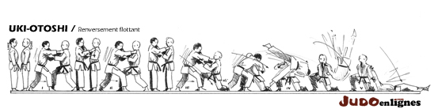

#### Ippon Seoinage
(Ippon = Punkt; Seoi = Schulter, Rücken; Nage = Wurf)

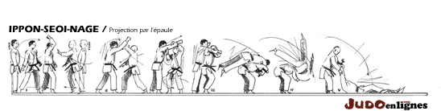

- 1 Bewegung
- Abstand 2 Meter
- Uke schräg
- Tori: Tief gehen!!!
- Uke: 
    - Beim 3. Schritt Fuß ran ziehen, "nach vorne fallen"
    - 1.Schritt ist ein halber!!!
    - 1, 2, 3. Schritt klein, steif machen, "hüpfen"

#### Kata Guruma
(Kata = Schulter, auch: Form, Zeremonie; Guruma = Rad)

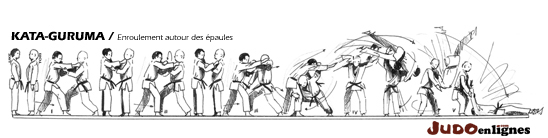

- Uke: steif machen und "drauf hüpfen"
- Tori greift oberhalb des Ellenbogens

## Koshi Waza

(Koshi-waza = Hüftetechniken)

#### Uki Goshi
(Uki = schweben, flattern, gleiten, schwimmen; Goshi = Hüfte)

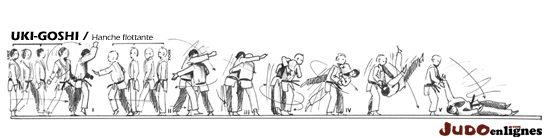

- Uke weit auf die Beine beim Schlag
- Uke darf Tori nicht auflaufen lassen!
- **Wichtig:** Uke schlägt gerade!
- Toris 1. Schritt kommt **mit** Ukes 2. Schritt
- Uke gibt beim 1. Schritt den Arm zum Greifen
- Uke läuft weiter!

#### Harai Goshi
(Harai = fegen, mähen; Goshi = Hüfte)

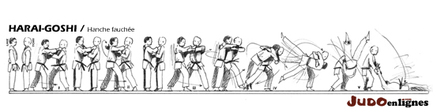

- Uke Füße parallel
- Tori:
    - 1.Schritt
    - 2.Schritt (Rücken greifen)
    - 3.Schritt (Ansatz)
    - Wurf

- Aufheben!!! (Standard Harai Goshi Ansatz)

#### Tsuri Komi Goshi

(Tsuri-komi = Hebezug, herumziehen; Komi = ziehen, drehen; Goshi = Hüfte)

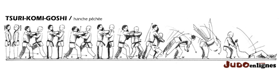

- Tori greift an den Kragen
- Uke letzter Schritt halb, Fuß nachziehen
- Abfolge: 3 Schritte, Eindrehen, Werfen

## Ashi Waza
(Ashi = Bein; Waza = Technik)

#### Okuri Ashi Barai
(Okuri = nachschicken, beide; Ashi = Bein; Barai = fegen)

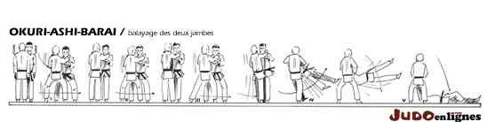
- Abfolge: 1x langsam, 2x schnell
- Uke fällt quasi selbst

#### Sasae Tsuri Komi Ashi
(Sasae = stützen; Tsuri-komi = Hebezug, herumziehen; Ashi = Bein)

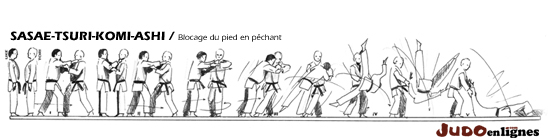

- Uke: 3 volle Schritte
- Tori geht beim 2. Schritt raus (Schleife) (siehe Bild)
- Rhythmus: 1, 2 und 3 (Schleife auf dem "und")

#### Uchi Mata
(Uchi = innen; Mata = Innenschenkelseite)

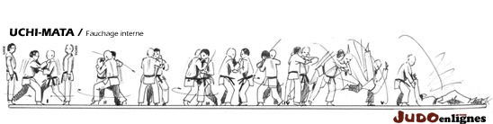

## Yoko Sutemi Waza
(Yoko-sutemi-waza = seitliche Körperwürfe)

#### Yoko Gake
(Yoko = kleine Bewegung; Gake = einhängen, haken)

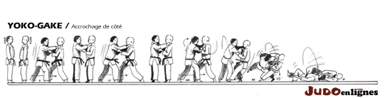

- 3 vollständige Schritte
- Uke wird "eingedreht"
- Tori "fegt"

#### Yoko Guruma
(Yoko = kleine Bewegung; Guruma = Rad)

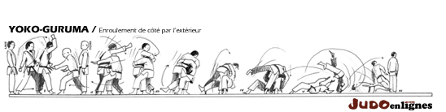

- Tori geht sehr tief rein

#### Uki Waza
(Uki = schweben, flattern, gleiten, schwimmen; Waza = Technik)

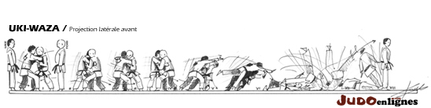

## Masutemi Waza

(Masutemi = gerade, "gerader Rücken", Waza = Technik)

#### Tomoe Nage
(Tomoe = Bogen, Kreis; Nage = werfen)

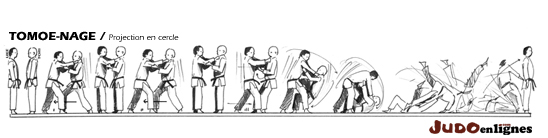

- **Mattenrand-Situation**
- Griff, beide rechts vor, 3 Schritte, Block (Uke), umgreifen (Doppel-Revert-Griff)
- Tori zieht Uke um, bzw. möchte Uke umziehen, Uke kommt mit rechtem Bein vor -> Wurf
- Uke kommt rechts weit vor (kurz vor dem Wurf)

#### Ura Nage
(Ura = entgegengesetzt; Nage = werfen)

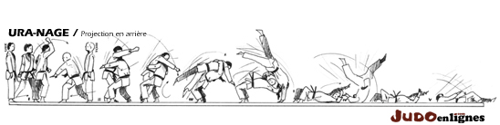

- **einziger Wurf bei dem Uke liegen bleibt**
- Info für Max: "Klaus ist nicht da!"
- Uke: Freier Fall, **1** Bewegung
- Uke: links, rechts, Freier Fall
- Tori: links, rechts parallel, nach unten rechts raus

#### Sumi Gaeshi
(Sumi = Ecken, Winkel; Gaeshi = Gegentechnik, Gegenangriff)

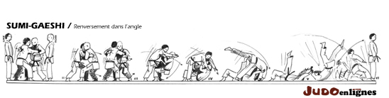

- Drehschritte am Anfang sind mindestens 60° (je mehr desto besser)
- Uke: 1, 2, 3 ran, rechtes Bein vor (vgl. Tomoe Nage)
- Tori: greifen, Schritt, Fuß ran + rein + runter, Wurf
- Tori: Knie zusammen!!!
- Tonne zwischen Uke und Tori
